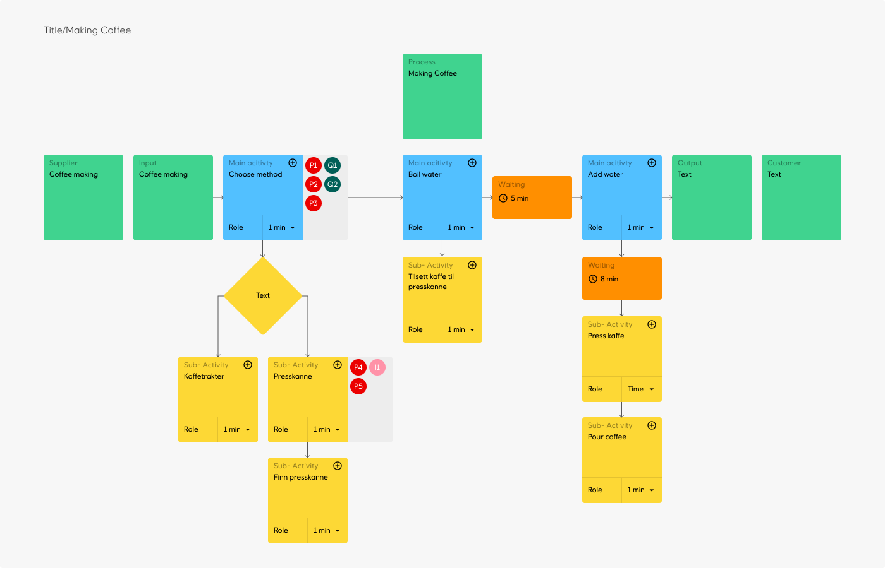

## VSM - Value Stream Mapping



# Links

- [Figma design & prototype](https://www.figma.com/file/IkHwmIQrsT0iR34f5R5UnZ/VSM)

# Tech stack / Features

|                  | Comment                                                                                                                                |
| ---------------- | -------------------------------------------------------------------------------------------------------------------------------------- |
| Library          | This is a [React](https://reactjs.org/) project                                                                                        |
| Package manager  | We use the [Yarn](https://yarnpkg.com/) -package-manager. To get started, run `yarn && yarn start`                                     |
| Navigation       | [NextJS](https://nextjs.org/)                                                                                                          |
| State management | [EasyPeasy](https://easy-peasy.now.sh/) persisted global store                                                                         |
| Canvas tools     | We heavily rely on canvas and use [PixiJS](https://www.pixijs.com/) to ease development.                                               |
| Testing          | TODO: [Testing-Library](https://testing-library.com/)                                                                                  |
| Code-Style       | We use [ESLint](https://eslint.org/) together with [Prettier](https://prettier.io/) for linting and enforcing a consistent code-style. |
| Authentication   | [@azure/msal-react](https://github.com/AzureAD/microsoft-authentication-library-for-js#readme)                                         |
| Styling          | [Sass](https://sass-lang.com/)                                                                                                         |
| Templates        |                                                                                                                                        |

# Developing

To get up and running:
`yarn && yarn use-dev`

## Running different environments locally

| Env. |     command     |
| ---- | :-------------: |
| Dev  | `yarn use-dev`  |
| Test | `yarn use-test` |
| QA   |  `yarn use-qa`  |
| PROD |     --TBD--     |

### What it does

For example: running `yarn use-dev` replaces the root `.env` file with `environment-variables/DEV.env`, then it
runs `yarn dev`.

## Branching and deploying stuff

We use a simple branching structure. Instead of having a `master` and `develop` branch we just use one `main`-branch.

The `main`-branch contains the latest changes.

We use a "sliding tag" for each environment... Tag something DEV, TEST, QA or PROD, and it should trigger a new build
and release. This gets rid of the "empty Pull requests" for releases, which is something we would have if we do a PR
into `Master` from `Develop`. Also, this gives us more flexibility to release from another branch if we need to do that
for some reason.

I've added a simple script to automate this:
For example; Run `yarn release-dev` to tag DEV and push tags to GitHub.

| Environment | Release script          | Deploy status                                                                                                                  | URL                                     | Who should test what?       | Comments                                                                         |
| ----------- | ----------------------- | ------------------------------------------------------------------------------------------------------------------------------ | --------------------------------------- | --------------------------- | -------------------------------------------------------------------------------- |
| DEV         | Run `yarn release-dev`  |    | https://web-vsm-dev.radix.equinor.com/  | Developer                   | Developer is free to use this environment however they want to                   |
| TEST        | Run `yarn release-test` |  | https://web-vsm-test.radix.equinor.com/ | Internal testing            | Developer tags what needs to be tested for QA-tester in the team                 |
| QA          | Run `yarn release-qa`   |      | https://web-vsm-qa.radix.equinor.com/   | "Product Owner" or Customer | When said feature is ready, it gets released into QA so our PO can give feedback |
| PROD        | Run `yarn release-prod` |  | https://web-vsm-prod.radix.equinor.com/ | End-users                   | We wait with deploying to prod until everyone is happy                           |

> **Note:** When running `yarn release-<environment>` we are starting a new build in Radix. If we already have a working build and want to release it to another environment, we may "promote" it to a different environment via the [Radix-console](https://console.radix.equinor.com/applications/vsm).

## Docker

```bash
# Building image
docker build -t vsm .

# Running image
## Dev
docker run -p 3000:3000 --env-file ./environment-variables/DEV.env vsm
## Test
docker run -p 3000:3000 --env-file ./environment-variables/TEST.env vsm
## QA
docker run -p 3000:3000 --env-file ./environment-variables/QA.env vsm
## Prod
docker run -p 3000:3000 --env-file ./environment-variables/PROD.env vsm
```

## Task tracking

### Workflow triggers

| GitHub Events        | Triggers |
| -------------------- | -------- |
| Pull request created |
| Pull request merged  |
| Commit created       |
| Branch created       |

## Runtime environment variables

When using NEXT.JS, the environment variables need to be set when building the image and not at runtime.

> Generally you'll want to use build-time environment variables to provide your configuration. The reason for this is that runtime configuration adds rendering / initialization overhead and is incompatible with Automatic Static Optimization.
>
> [Read more ...](https://nextjs.org/docs/api-reference/next.config.js/runtime-configuration)

To work-around this we are disabling "automatic static optimization" at our root level. Adding this to `_app.tsx`:

```javascript
MyApp.getInitialProps = async (appContext: AppContext) => {
  const appProps = await App.getInitialProps(appContext);

  return { ...appProps };
};
```

Which disables "automatic static optimization" for all our
pages. [Read more ...](https://github.com/vercel/next.js/blob/master/errors/opt-out-auto-static-optimization.md)

# Pixi js Canvas

## Making space for stuff

Put every Main activity and all it's children inside a container. That container width can be used to figure out
the distance to the next Main Activity etc...

# Defining a process

A vsm/process consists of a set of entities.

An entity can be of the following types:

- MainActivity
- SubActivity
- Choice
- Waiting

Structure of an entity

```json5
{
  id: "",
  type: "MainActivity",
  text: "",
  roles: [],
  duration: 0,
  problems: [],
  ideas: [],
  solutions: [],
  parentId: "",
}
```

# API-Endpoints

See swagger https://vsm-api-dev.azurewebsites.net/swagger/index.html

## Project

> NB: The following documentation is out of date. It was written before implementation to get our thoughts flowing.
> TODO: Update documentation

Create Project Read Project Update Project Delete Project

### Project object

Details WIP

```JSON5
{
  id: '',
  owner: [],
  created: 'date',
  lastUpdated: 'date',
  Entities: []
  // [{entity},{entity},{entity}],
}
```

## Entity

### Create Entity

POST `/entity`

body:

```JSON5
{
  id: '',
  type: 'Main Activity',
  text: '',
  roles: [],
  duration: '',
  problems: [],
  ideas: [],
  solutions: [],
  parentId: ''
}
```

### Read Entity

GET `/entity/{id}`

### Update Entity

PUT (or PATCH?) `/entity/{id}`

### Delete Entity

DELETE `/entity/{id}`

# Post new process - Example request bodies

## Just the standard stuff

```typescript
///POST -> 'api/v1.0/project'
const payload = {
  name: processTitle,
  objects: [
    {
      parent: 0,
      name: processTitle,
      fkObjectType: vsmObjectTypes.process,
      childObjects: [
        { fkObjectType: vsmObjectTypes.supplier, name: "supplier" },
        { fkObjectType: vsmObjectTypes.input, Name: "input" },
        { fkObjectType: vsmObjectTypes.output, name: "output" },
        { fkObjectType: vsmObjectTypes.customer, name: "customer" },
      ],
    },
  ],
} as vsmProcessObject;
```

## Everything but the kitchen sink

> NB. Actually missing choice. (Waiting on api-support)

```typescript
///POST -> 'api/v1.0/project'
const payload = {
  name: processTitle,
  objects: [
    {
      parent: 0,
      name: processTitle,
      fkObjectType: vsmObjectTypes.process,
      childObjects: [
        { fkObjectType: vsmObjectTypes.supplier, name: "supplier" },
        { FkObjectType: vsmObjectTypes.input, Name: "input" },
        {
          FkObjectType: vsmObjectTypes.mainActivity,
          Name: "Choose method",
          childObjects: [
            {
              name: "Kaffetrakter",
              fkObjectType: vsmObjectTypes.subActivity,
            },
            {
              name: "Presskanne",
              fkObjectType: vsmObjectTypes.subActivity,
              childObjects: [
                {
                  name: "Finn presskanne",
                  fkObjectType: vsmObjectTypes.subActivity,
                },
              ],
            },
          ],
        },
        {
          FkObjectType: vsmObjectTypes.mainActivity,
          Name: "Boil water",
          childObjects: [
            {
              name: "Tilsett kaffe til presskanne",
              fkObjectType: vsmObjectTypes.subActivity,
            },
          ],
        },
        {
          FkObjectType: vsmObjectTypes.waiting,
          Name: "Waiting",
        },
        {
          FkObjectType: vsmObjectTypes.mainActivity,
          Name: "Add water",
          childObjects: [
            {
              name: "Waiting",
              fkObjectType: vsmObjectTypes.waiting,
              childObjects: [
                {
                  name: "Press kaffe",
                  fkObjectType: vsmObjectTypes.subActivity,
                  childObjects: [
                    {
                      name: "Pour coffee",
                      fkObjectType: vsmObjectTypes.subActivity,
                    },
                  ],
                },
              ],
            },
          ],
        },
        { fkObjectType: vsmObjectTypes.output, name: "output" },
        { fkObjectType: vsmObjectTypes.customer, name: "customer" },
      ],
    },
  ],
} as vsmProcessObject;
```

# Random

## Manual consent url

```text
https://login.microsoftonline.com/statoilsrm.onmicrosoft.com/oauth2/authorize?
client_id=e6e2f3c4-d6bd-4d71-a00e-be0c16a703da
&response_type=code
&redirect_uri=https://www.getpostman.com/oauth2/callback
&nonce=1234
&resource=b3e899bf-12af-4f63-8744-d1ef4edc30b5
&prompt=consent
```
